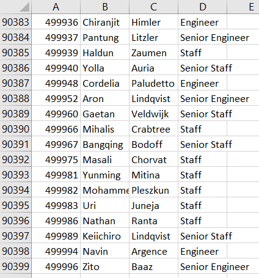
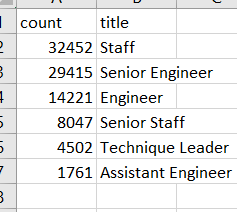

1. Overview of the analysis: 
Explain the purpose of this analysis.
The purpose of this analysis is to determine the number of retiring employees per title, and identify employees who are eligible to participate in mentorship program. The idea is to understand level of hiring needs where existing employees retire.
 
2. Results 
Provide a bullet list with four major points from the two analysis deliverable. Use images as support where needed.
- There are about 90,389 titles looking to potentially retire soon given the eligible with age. 

- Retiring titles are the highest with Staff at 32,452.

- There are about 1941 employees eligible for mentor ship

- There will be lots of hiring needs to operate with 90,389 titles looking to retire soon.

3. Summary 
Provide high-level responses to the following questions, then provide two additional queries or tables that may provide more insight into the upcoming "silver tsunami."

- How many roles will need to be filled as the "silver tsunami" begins to make an impact?

About 90,389 roles will needed to be fill once silver tsunami begins.

- Are there enough qualified, retirement-ready employees in the departments to mentor the next generation of Pewlett Hackard employees?

Yes there are enough retirement-ready employees in the departments to mentor the next generation. 
